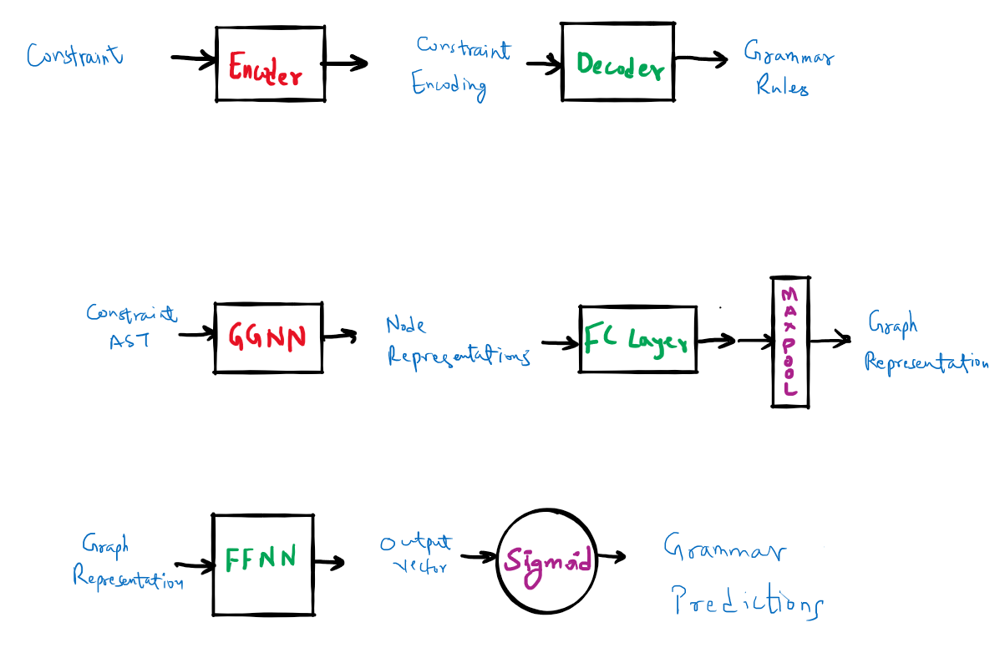

# tse-mini-project2

Model Implementation for tse mini project 1

### Encoder Decoder Architecture:
Encoder: ```ggnn_encoder.py```

Decoder: ```ffnn_decoder.py```



### Steps to run the experiment

1. Clone the repo: ```git clone https://github.com/rrlcs/tse-mini-project2.git```
2. Extract the dataset: ```gunzip dataset.json.gz```
3. Train the network: ```python train.py```
4. Evaluate the network: ```python evaluate.py```
5. Plot the losses: ```python plot.py```

#### This Project is in continuation to tse mini project 1 and is done under the course Topics in Software Engineering at Indian Institute of Science Guided by Prof. Aditya Kanade and Prof. Shirish Shevde
